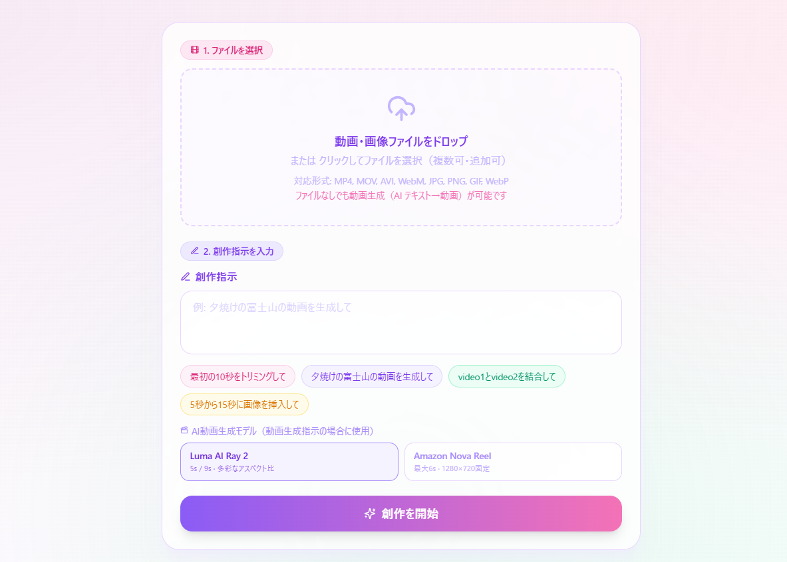

# video-edit-by-strands-agents

AI 動画編集・動画生成アプリ — Strands Agents × Amazon Bedrock × AgentCore Runtime

## UIはこんな感じです



## 生成動画サンプル

**Amazon Nova Reel** — 夕焼けの富士山

[▶ ダウンロード / 再生](docs/videos/nova_generated.mp4)

> GitHubでは動画ファイルのリンクをクリック → **View raw** で再生できます。

---

## アーキテクチャ

```
ブラウザ (React/Vite)
  │
  ├─ S3 Presigned URL → S3 (動画/画像アップロード)
  │    └─ S3 PUT イベント → Lambda (analyzer) → Claude Vision でファイル即時分析 → DynamoDB
  │
  └─ API Gateway (HTTP API v2)
       ├─ GET    /upload-url       → Lambda → S3 Presigned PUT URL
       ├─ POST   /tasks            → Lambda → SQS → runner Lambda → AgentCore Runtime
       ├─ GET    /tasks/{id}       → Lambda → DynamoDB (ステータスポーリング)
       ├─ GET    /download-url/{id}→ Lambda → S3 Presigned GET URL
       ├─ POST   /chat             → Lambda → DynamoDB (チャット履歴管理)
       └─ DELETE /files            → Lambda → S3 入力ファイル削除

AgentCore Runtime (Strands Agent, us-east-1)
  ├─ Strands Agent + BedrockModel (Claude Sonnet 4.6, us-east-1)
  ├─ MoviePy + ffmpeg による動画編集（trim / concat / add_text / fade 等 20種類）
  ├─ Claude Vision による動画フレーム分析 / Amazon Transcribe による音声テキスト化
  ├─ Amazon Nova Reel (us-east-1) による AI 動画生成
  │    └─ N.Virginia S3 (nova-reel-output) → Tokyo S3 (assets) にクロスリージョン転送
  ├─ Amazon Nova Canvas (us-east-1) による AI 画像生成
  ├─ Amazon Polly (ap-northeast-1) による音声合成
  └─ 処理結果を S3 / DynamoDB に書き込み

フロントエンド配信
  CloudFront → S3 (静的サイト)

DynamoDB テーブル構成
  ├─ {project}-tasks          — タスクステータス管理 (task_id PK)
  ├─ {project}-file-analysis  — ファイル分析結果キャッシュ (s3_key PK, TTL 24h)
  └─ {project}-chat-sessions  — チャット会話履歴 (session_id PK)

S3 バケット構成
  ├─ video-edit-assets-{account}               (ap-northeast-1) — 入出力ファイル・最終動画
  ├─ video-edit-frontend-{account}             (ap-northeast-1) — React 静的ファイル
  └─ bedrock-video-generation-us-east-1-{id}   (us-east-1)      — Nova Reel 生成中間ファイル
       ※ Bedrock コンソールで Amazon Nova Reel を有効化した際に AWS が自動作成
```

## 前提条件

- AWS CLI（認証済み）+ Terraform >= 1.6
- Docker（ECR へのプッシュ用）
- Node.js >= 20（フロントエンドビルド）
- Amazon Bedrock で以下のモデルを有効化済み:
  - `us.anthropic.claude-sonnet-4-6` — **us-east-1**（LLM エージェント）
  - `amazon.nova-reel-v1:0` — **us-east-1**（AI 動画生成 / Amazon Nova Reel）
    > Bedrock コンソール (us-east-1) で有効化する際、S3 バケットの作成を求めるダイアログが表示されます。
    > 「確認」をクリックして AWS が自動作成するバケット（`bedrock-video-generation-us-east-1-{id}`）をそのまま使用します。
    > 作成されたバケット名を `infrastructure/terraform.tfvars` の `nova_reel_s3_bucket_name` に設定してください。

## デプロイ手順

> **AWS を初めて使う方へ**: アカウント作成・IAM Identity Center の設定・Bedrock モデルの有効化など、ゼロから構築する詳細手順は **[DEPLOYMENT_GUIDE.md](DEPLOYMENT_GUIDE.md)** を参照してください。

以下はすでに AWS 環境が整っている方向けの概要手順です。

### 1. Terraform でインフラを構築

```bash
cd infrastructure
terraform init
terraform apply
```

S3 バケット（Tokyo）・IAM・Lambda・SQS・ECR・CloudFront が自動作成されます。
Nova Reel の出力バケットは Bedrock コンソールでモデルを有効化した際に AWS が自動作成します。
バケット名を `terraform.tfvars` の `nova_reel_s3_bucket_name` に設定してから `apply` を実行してください。

`terraform output` で以下の値を確認する：

| Output | 用途 |
|--------|------|
| `ecr_repository_url` | Docker イメージのプッシュ先（ap-northeast-1） |
| `ecr_repository_url_useast1` | AgentCore 用 Docker イメージのプッシュ先（us-east-1） |
| `api_url` | フロントエンドの `VITE_API_URL` |
| `frontend_url` | アプリの公開 URL |
| `s3_bucket` | アセット S3 バケット名（ap-northeast-1） |
| `nova_reel_output_bucket` | Nova Reel 出力バケット名（us-east-1） |
| `sqs_task_queue_url` | SQS タスクキュー URL |
| `agentcore_runtime_role_arn` | AgentCore Runtime 用 IAM ロール ARN |

---

### 2. AgentCore エージェントイメージをビルド & デプロイ

```bash
# ワンコマンドで ECR push → AgentCore Runtime 作成/更新 → Terraform apply
./scripts/deploy-agentcore.sh
# AWS_PROFILE=<profile> ./scripts/deploy-agentcore.sh  # プロファイル指定
```

内部で以下を実行します：
1. Terraform outputs から ECR URL・IAM ロール ARN を取得
2. ARM64 コンテナイメージをビルド
3. ECR (us-east-1) にプッシュ
4. AgentCore Runtime を作成または更新
5. ARN を `terraform.tfvars` に書き込み → `terraform apply`

---

### 3. フロントエンドをビルド & デプロイ

```bash
cd frontend

# API URL を設定
API_URL=$(terraform -chdir=../infrastructure output -raw api_url)
echo "VITE_API_URL=$API_URL" > .env

# プロキシ環境の場合は --no-proxy を付ける
npm install --no-proxy
npm run build

# S3 に同期（バケット名は terraform output で確認）
FRONTEND_BUCKET="$(terraform -chdir=../infrastructure output -raw s3_bucket | sed 's/assets/frontend/')"
aws s3 sync dist/ s3://$FRONTEND_BUCKET/ \
  --profile <your-profile> --region ap-northeast-1

# CloudFront キャッシュ無効化（再デプロイ時）
# aws cloudfront create-invalidation --distribution-id <id> --paths "/*"
```

---

## 使い方

1. `frontend_url` をブラウザで開く
   - 初回アクセス時はオンボーディングモーダルが表示される（「スキップ」または「はじめる」で閉じる）
2. 動画ファイル（MP4 等）や画像ファイルをドラッグ＆ドロップでアップロード（任意・複数可）
   - アップロード直後に Claude Vision が自動分析し、チャット提案に活用される
   - ファイルなしでも「スキップ（テキストから生成）」リンクで指示欄にジャンプできる
3. 自然言語で創作指示を入力
   - **直接入力**: サンプルプロンプトをクリックしてワンタップで入力も可能
   - **AI チャットモード**: セグメントコントロールで「AIと相談しながら作成」に切替し、対話で指示を整理→確定すると指示欄に反映
4. 右カラムの AI 動画生成モデルを選択（Amazon Nova Reel / 使用しない）
   - 選択するとモデルの特徴が直下に表示される
5. 「創作を開始」をクリック（指示未入力の場合はボタンが無効）
6. AgentCore Runtime でエージェントが起動し、処理が完了するとプレビューとダウンロードが表示される

### 指示例（動画編集）

```
最初の10秒をトリミングして
```
```
video1.mp4 と video2.mp4 を結合して
```
```
5秒から15秒の間に logo.png を挿入して
```

### 指示例（AI 動画生成）

```
夕焼けの富士山をドローンで撮影したような動画を生成して
```
```
猫が草原で楽しく遊ぶ縦型動画を作成して
```
```
9秒の横向き動画で、雨の夜の東京の街並みを生成して
```

> ファイルをアップロードしなくても動画生成（テキスト→動画）が可能です。

---

## エージェントのツール

### ファイル操作

| ツール | 機能 |
|--------|------|
| `list_files` | タスクに紐づく入力ファイル一覧を取得 |

### 動画編集（MoviePy）

| ツール | 機能 |
|--------|------|
| `trim_video` | 動画の指定時間範囲をトリミング |
| `insert_image` | 動画の指定時間範囲に画像をフルフレーム挿入 |
| `image_to_clip` | 静止画を指定秒数の動画クリップに変換（スライド動画作成） |
| `concat_videos` | 複数動画を順番に結合 |
| `add_text` | 字幕・テロップのオーバーレイ（日本語対応） |
| `add_audio` | BGM・効果音を既存音声にミックス |
| `replace_audio` | 音声トラックを差し替え |
| `change_speed` | 再生速度変更（0.1〜10.0倍） |
| `fade_in_out` | フェードイン・フェードアウト（映像＋音声） |
| `crossfade_concat` | クロスフェードトランジション付き動画結合 |
| `resize_crop` | 解像度変更・クロップ |
| `rotate_flip` | 回転・反転（左右/上下） |
| `overlay_image` | 画像の透過合成オーバーレイ（ロゴ・PinP） |
| `extract_audio` | 音声をMP3で抽出 |
| `adjust_volume` | 音量調整（0.0〜4.0倍） |
| `color_filter` | カラーフィルター（grayscale / brightness / contrast） |

### 動画分析

| ツール | 機能 |
|--------|------|
| `analyze_video` | フレーム抽出 + Claude Vision で動画内容を分析 |
| `transcribe_video` | Amazon Transcribe で音声をテキスト化（語レベルタイムスタンプ付き） |
| `detect_scenes` | ffmpeg でシーンチェンジを自動検出 |

### AI 生成

| ツール | 機能 |
|--------|------|
| `generate_video_nova_reel` | テキストから動画生成（Amazon Nova Reel、最大6s、1280×720固定） |
| `generate_image` | テキストから画像生成（Amazon Nova Canvas、PNG） |
| `generate_speech` | テキスト音声合成（Amazon Polly、MP3） |

### generate_video_nova_reel パラメータ（Amazon Nova Reel）

| パラメータ | 説明 | デフォルト |
|-----------|------|-----------|
| `prompt` | 生成する動画の説明（最大 512 文字） | — |
| `duration_sec` | 長さ（秒）: 1〜6 の整数。解像度は 1280×720 固定 | `6` |

---

## ローカル開発

```bash
# フロントエンド開発サーバー
cd frontend
npm install
VITE_API_URL=https://<your-api-url> npm run dev
```

---

## リソース削除

```bash
cd infrastructure
terraform destroy
```

> **注意**: S3 バケットにオブジェクトが残っている場合は先に手動削除が必要です。
> 削除対象バケット: `video-edit-assets-{account}`, `video-edit-frontend-{account}`
>
> `bedrock-video-generation-us-west-2-{id}` および `bedrock-video-generation-us-east-1-{id}` は
> AWS が管理するバケットのため、Terraform では削除されません。不要な場合は AWS コンソールから手動削除してください。
